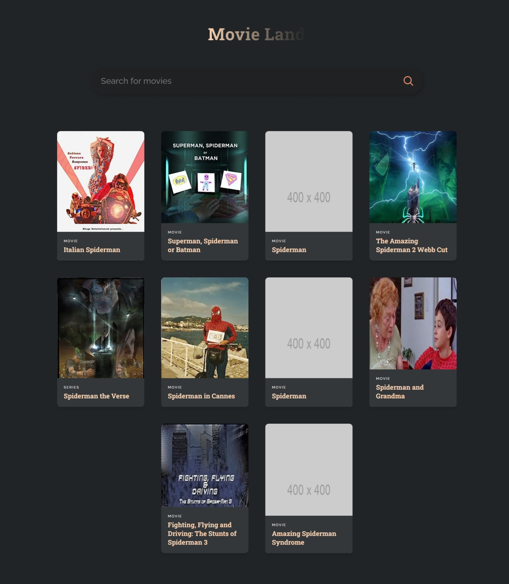

Sure, here's a structured README.md text for your Movie_land project, formatted as plain text:

---

# Movie_Land - Movie Search Application 🎥


## Overview

Movie_land is a React-based movie search application designed to allow users to search for movies and view details such as posters, titles, types, and release years. It utilizes the Open Movie Database (OMDb) API to fetch movie data and displays results in a responsive grid layout.

## Features

- Search for movies using the OMDb API.
- Display movie information including posters, titles, types, and years.
- Responsive design for desktop and mobile devices.

## User Roles and Functionalities

Movie_land is a single-user application with no role-based access control. All functionalities are available to the end user without differentiation based on user roles.

## Tech Stack

This React project utilizes the following technologies:

- **React**: A JavaScript library for building user interfaces.
- **Create React App**: A comfortable environment for learning React, and the best way to start building a new single-page application in React.
- **Bootstrap**: Used for styling and ensuring responsive design.
- **React Testing Library**: For testing React components.


## Installation and Running Instructions

### Prerequisites

- Node.js installed on your local machine.
- Access to the internet for fetching dependencies and movie data from the OMDb API.

### Backend Setup

No backend setup is required as Movie_land solely relies on client-side operations and the OMDb API for fetching movie data.

### Frontend Setup

1. Clone the repository to your local machine:

   ```
   git clone https://github.com/your-username/Movie_land.git
   ```

2. Navigate into the project directory:

   ```
   cd Movie_land
   ```

3. Install dependencies using npm:

   ```
   npm install
   ```

### Accessing the Application

1. Once dependencies are installed, start the development server:

   ```
   npm start
   ```

2. Open your browser and visit `http://localhost:3000` to view Movie_land.


## Contributing

Contributions are welcome! If you have any suggestions, improvements, or feature requests, feel free to open an issue or submit a pull request.

